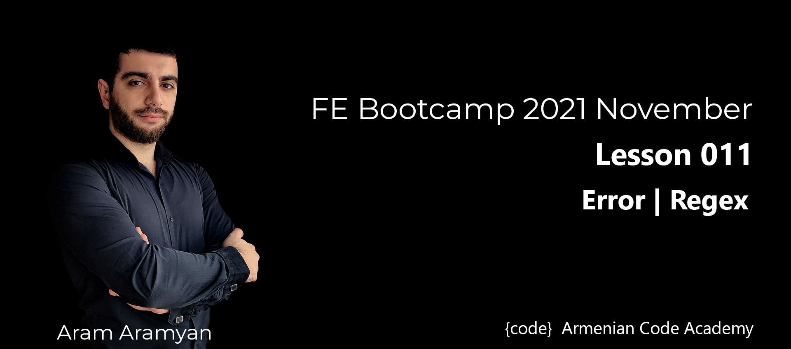

---
# **Errors**

**Task 1**\
*Complete the reverseString function, it has one parameter s. You must perform the following actions:*

  1. *Try to reverse string s using the split, reverse, and join methods.*
  2. *If an exception is thrown, catch it and print the contents of the exception's message on a new line.*
  3. *Print s on new line. If no exception was thrown, then this should be the reversed string, if an exception was thrown, this should be the original string.*

**Input Format**\
*Locked stub code in the editor reads variable s from stdin and passes it to the function.*

**Output Format**\
*You must write two print statements using console.log():*

1. *Print the contents of a caught exception's message on a new line. If no exception was thrown, this line should not be printed.*
2. *Print s on a new line. If no exception was thrown, then this should be the reversed string, if an exception was thrown, this should be the original string.*

**Simple Input 0**

```js
Number(1234)
```
**Simple Input 0**

```js
s.split is not a function
```
[**SOLUTION**](reverseString.js)
___

**Task 2**\
*Complete the isPositive function below. It has one integer parameter a. If the value of a is positive, it must return the string YES. Otherwise, it must throw an Error according to the following rules:*
1. *If a is 0, throw an Error with message = Zero Error.*
2. *If a is negative, throw an Error with message = Negative Error.*

[**SOLUTION**](isPositive.js)
___

**Task 3**\
*Convert the code using try...catch.*

```js
function reverseString(s) {
  typeof s !== "string"
  ? console.log("s.split is not a function")
  : (s = s.split("").reverse().join(""));
  console.log(s);
}
```
[**SOLUTION**](convertCode.js)
___

**Task 4**\
*A teacher has created a gradeLabs function that verifies if student programming labs work. This function loops over an array of JavaScript objects that should contain a student property and runLab property. The runLab property is expected to be a function containing the student's code. The runLab function is called and the result is compared to the expected result. If the result and expected results don't match, then the lab is considered a failure.*\
\
*The gradeLabs function works for the majority of cases. However, what happens if a student named their function incorrectly? Run gradeLabs and pass it studentLabs2 as defined below.*

```js
let studentLabs2 = [
  {
    student: "Blake",
    myCode: function (num) {
      return Math.pow(num, num);
    },
  },
  {
    student: "Jessica",
    runLab: function (num) {
      return Math.pow(num, num);
    },
  },
  {
    student: "Mya",
    runLab: function (num) {
      return num * num;
    },
  },
];
gradeLabs(studentLabs2);
```
*Upon running the second example, the teacher gets TypeError: lab.runLab is not a function.*\
\
*Add a try/catch block inside of gradeLabs to catch an exception if the runLab property is not defined. If the exception is thrown, the result should be set to the text "Error thrown".*

[**SOLUTION**](gradeLabs.js)
___
# **Regex**

* Pass [following tutorial](https://regexone.com/lesson/whitespaces) and convert all the codes into js with usage.
* Create a RegExp myRegExp to test if a string is a valid pin or not. A valid pin has:

1. Exactly 4 or 6 characters.
2. Only numerical characters (0-9).
3. No whitespace.

| **Input** | **Output** |
|-----------|------|
| myRegExp.test("1234") | true |
| myRegExp.test("45135") | false |
| myRegExp.test("89abc1") | false |
| myRegExp.test("900876") | true |
| myRegExp.test(" 4983") | false |

[**SOLUTION**](regexp.js)
___